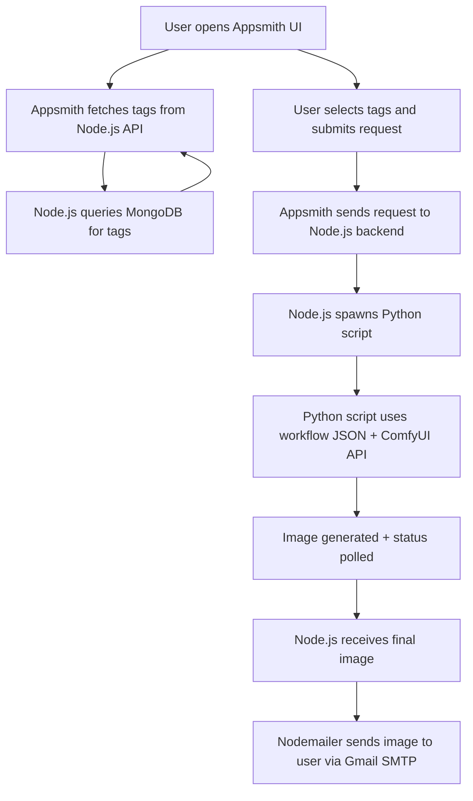

# 🌸 Marin Kitagawa Image Generator  

Create stunning AI-generated images of **Marin Kitagawa** with customizable tags and prompts.  

---

## 🎨 About Marin Kitagawa  
This project is inspired by **Marin Kitagawa**, the vibrant protagonist from *My Dress-Up Darling (Sono Bisque Doll wa Koi wo Suru)*. Known for her passion for cosplay and infectious personality, Marin has become a beloved character in the anime community.  

The generator uses a **LoRA** trained by me, available both on GitHub and CivitAI:  
- GitHub: [MarinKitagawa_LoRA](https://github.com/mehta-manan/MarinKitagawa_LoRA)  
- CivitAI: [Marin Kitagawa LoRA](https://civitai.com/models/1877738/marin-kitagawa)  

---

## 🏗️ Architecture  



---

## 🚀 Quick Start  

### Prerequisites  
- Node.js **v20.15.1**  
- Python **v3.10.9** (ComfyUI includes embedded Python if not installed)  
- [ComfyUI](https://github.com/comfyanonymous/ComfyUI) installed & running  
- MongoDB instance (local or Atlas)  
- Gmail account with App Password for SMTP  

---

### Installation  

**1. Clone the repository**  
```bash
git clone https://github.com/mehta-manan/MarinKitagawa_ImageGenerator.git
cd MarinKitagawa_ImageGenerator/backend
```

**2. Install Node.js dependencies**  
```bash
npm install
```

**3. Install Python dependencies**  
```bash
pip install -r requirements.txt
```

**4. Setup ComfyUI**  
- Use the **`run_nvidia_gpu.bat`** file that ships with ComfyUI (Windows GPU launch).  
- The application uses a workflow in API format:  
  ```
  MarinKitagawa_ImageGenerator\backend\ComfyUI\API_workflow\txt2image_Lora_MK_API.json
  ```  
  This workflow is automatically loaded and updated by the backend scripts.  

**5. Configure environment variables**  
Create a `.env` file:  
```bash
PORT=
DB_USER=
DB_PASSWORD=
DB_NAME=
SMTP_HOST=
SMTP_PORT=
SMTP_USER=
SMTP_PASS=
COMFY_HOST=http://127.0.0.1:8188
```

**6. Start the server**  
```bash
npm start
```

---

## 📋 How It Works  

1. **Appsmith frontend** lets users select tags and enter their email.  
2. **Node.js backend** validates the request, sends an immediate response, and spawns a Python script.  
3. **Python script (`marin_kitagawa_API.py`)** loads the JSON workflow, injects tags & random seed, and sends a request to ComfyUI API.  
4. The script polls ComfyUI until the image is generated, then returns it as **base64 JSON**.  
5. **Node.js** receives the image, attaches it to an email, and delivers it via **Gmail SMTP**.  

---

## 📋 Core Dependencies  

### Node.js  
- **express** – API server  
- **mongoose** – MongoDB ODM  
- **nodemailer** – Gmail SMTP integration  
- **body-parser, cors** – middleware  

### Python  
- **requests** – API calls to ComfyUI  
- **dotenv, subprocess, json** – env handling, spawning, response parsing  

### External  
- **ComfyUI** – Stable Diffusion backend with Illustrious model  
- **MongoDB** – Stores tag metadata  
- **Appsmith Cloud** – Frontend UI  

---

## 🔧 Configuration  

### ComfyUI  
Start using the provided batch file:  
```bash
run_nvidia_gpu.bat
```  
This ensures GPU acceleration is enabled.  

### Gmail SMTP  
1. Enable 2FA in Gmail  
2. Generate an **App Password**  
3. Use the app password in `.env`  

### MongoDB  
- Store generation tags in a collection for dynamic selection in Appsmith UI  

---

## 🤝 Contributing  
1. Fork the repository  
2. Create a branch (`git checkout -b feature/amazing-feature`)  
3. Commit changes (`git commit -m 'Add amazing feature'`)  
4. Push (`git push origin feature/amazing-feature`)  
5. Open a Pull Request  

---

## 📧 Support  
- Open an issue on GitHub  
- Check ComfyUI logs for generation problems  
- Images are delivered via Gmail SMTP (check spam folder if missing)  

---

## ⚠️ Notes  
- **ComfyUI required** – must be running via `run_nvidia_gpu.bat`  
- **Workflow JSON** – `txt2image_Lora_MK_API.json` is used by backend scripts  
- **Model setup** – Illustrious model + LoRA must be loaded correctly  
- **Email delivery** – Requires Gmail SMTP with App Password  

---

## 🙏 Acknowledgments  
- **ComfyUI** – Powerful AI generation backend  
- **Appsmith** – No-code frontend platform  
- **Illustrious model** – High-quality anime generation  
- **Anime community** – For inspiration  

---

<div align="center">  
✨ Made with ❤️ for the anime community ✨  
</div>  
