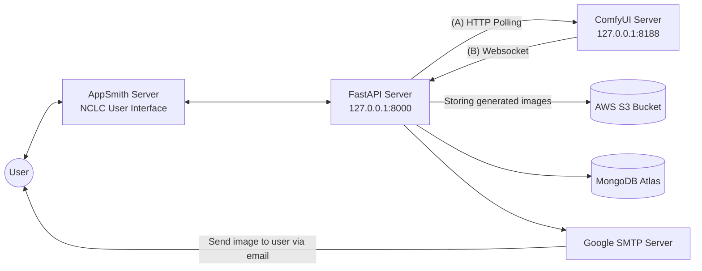

# 🌸 Marin Kitagawa Image Generator

Create stunning AI-generated images of **Marin Kitagawa** with customizable tags and prompts — now with a **FastAPI** backend, **JWT authentication**, and a personal **S3-backed gallery** with pagination.


---

## 🎨 About Marin Kitagawa
This project is inspired by **Marin Kitagawa**, the vibrant protagonist from *My Dress-Up Darling (Sono Bisque Doll wa Koi wo Suru)*. Known for her passion for cosplay and infectious personality, Marin has become a beloved character in the anime community.

The generator uses a **LoRA** trained by me, available both on GitHub and CivitAI:
- GitHub: [MarinKitagawa_LoRA](https://github.com/mehta-manan/MarinKitagawa_LoRA)
- CivitAI: [Marin Kitagawa LoRA](https://civitai.com/models/1877738/marin-kitagawa)

Backend source: [backend_FastAPI](https://github.com/mehta-manan/MarinKitagawa_ImageGenerator/tree/main/backend_FastAPI)

---

## 🆕 What's New (v2)
- 🔁 **Backend rewritten in Python (FastAPI)** — the previous Node.js/Express service has been **fully replaced and is no longer supported**. This release is **not backward compatible** with the old Node.js backend, its `.env` layout, or its API contract.
- ⚙️ **No more spawned Python subprocess** — image generation now runs via **FastAPI `BackgroundTasks`** combined with **`asyncio`**, in-process, instead of the old flow where Node.js spawned a separate Python script.
- 🔐 **JWT authentication** — users sign up / log in and every generation & gallery request is authenticated.
- 🖼️ **Personal gallery** — users can browse all images they've generated.
- 📄 **Pagination** — gallery and image-list endpoints support paginated responses.
- ☁️ **Amazon S3 storage** — generated images are uploaded to S3 instead of being emailed as base64 attachments, and the gallery streams them from there.

> ⚠️ **Breaking change:** The Node.js backend (`/backend`) is deprecated and unmaintained. All new development happens in `/backend_FastAPI`. Do not mix the two.

---

## 🏗️ Architecture


```mermaid
flowchart LR
    User((User))
    Appsmith[AppSmith Server<br/>NCLC User Interface]
    FastAPI[FastAPI Server<br/>127.0.0.1:8000]
    Comfy[ComfyUI Server<br/>127.0.0.1:8188]
    Mongo[(MongoDB Atlas)]
    S3[(AWS S3 Bucket)]
    SMTP[Google SMTP Server]

    User <--> Appsmith
    Appsmith <--> FastAPI
    FastAPI -- "(A) HTTP Polling" --> Comfy
    Comfy -- "(B) Websocket" --> FastAPI
    FastAPI -- "Storing generated images" --> S3
    FastAPI --> Mongo
    FastAPI --> SMTP
    SMTP -- "Send image to user via email" --> User
```

**Components**

| Component | Role |
|---|---|
| **AppSmith Server** | User-facing UI: sign-up, sign-in, create images, view images, view profile |
| **FastAPI Server** | Application server responsible for user registration/authentication/authorization, loading tags from the database, storing image & prompt metadata, and proxying requests to ComfyUI (via HTTP polling or Websockets) |
| **ComfyUI Server** | Open-source image and video generation service |
| **MongoDB Atlas** | Stores user information, tags, image metadata, and user prompts |
| **AWS S3 Bucket** | Stores images generated by the user |
| **Google SMTP Server** | Delivers generated images to the user via email |

FastAPI talks to ComfyUI two ways: **(A) HTTP polling** to check generation status, and **(B) Websocket** for real-time updates from ComfyUI back to FastAPI.

---

## 🚀 Quick Start

### Prerequisites
- Python **v3.10.9+**
- [ComfyUI](https://github.com/comfyanonymous/ComfyUI) installed & running
- MongoDB instance (local or Atlas)
- Amazon S3 bucket + IAM credentials (for image storage)
- Gmail account with App Password for SMTP (for notifications)

---

### Installation

**1. Clone the repository**
```bash
git clone https://github.com/mehta-manan/MarinKitagawa_ImageGenerator.git
cd MarinKitagawa_ImageGenerator/backend_FastAPI
```

**2. Create a virtual environment & install dependencies**
```bash
python -m venv venv
source venv/bin/activate   # On Windows: venv\Scripts\activate
pip install -r requirements.txt
```

**3. Setup ComfyUI**
- Use the **`run_nvidia_gpu.bat`** file that ships with ComfyUI (Windows GPU launch).
- The application uses a workflow in API format:
  ```
  MarinKitagawa_ImageGenerator/backend_FastAPI/ComfyUI/API_workflow/txt2image_Lora_MK_API.json
  ```
  This workflow is automatically loaded and updated by the backend scripts.

**4. Configure environment variables**
Create a `.env` file:
```bash
PORT=8000

# MongoDB
DB_USER=
DB_PASS=
DB_NAME=

# JWT
SECRET_KEY=
ALGORITHM=
EXP_TIME=

# AWS S3
S3_BUCKET_NAME=
S3_REGION_NAME=
S3_ACCESS_KEY_ID=
S3_SECRET_ACCESS_KEY=

# SMTP (Gmail)
SMTP_HOST=
SMTP_PORT=
SMTP_USER=
SMTP_PASS=
MAIL_FROM=

# ComfyUI — local
HTTP=http
WS=ws
COMFYUI_SERVER=127.0.0.1:8188

# ComfyUI — prod
# HTTP=https
# WS=wss
# COMFYUI_SERVER=
```

**5. Start the server**
```bash
uvicorn main:app --host 0.0.0.0 --port 8000 --reload
```

---

## 📋 How It Works

1. **Appsmith frontend** lets users sign up, log in, select tags, and submit generation requests.
2. **FastAPI backend** validates the user's **JWT**, then immediately returns a response and queues the generation work as an **async `BackgroundTask`** — no separate process is spawned; everything runs on FastAPI's `asyncio` event loop.
3. The background task loads the JSON workflow, injects tags & a random seed, and talks to the **ComfyUI API** asynchronously (via HTTP polling and/or Websocket), all within the same FastAPI process.
4. The task polls ComfyUI until the image is ready, then **uploads it to Amazon S3** and stores the resulting URL and metadata in MongoDB.
5. The user is notified via **Gmail SMTP**, and can revisit their **Gallery** at any time to view all previously generated images, served **paginated** from MongoDB/S3.

---

## 🔐 Authentication

- Users register and log in via FastAPI auth endpoints.
- On successful login, the API issues a **JWT access token**.
- The token must be sent as a `Bearer` token in the `Authorization` header for all protected endpoints (image generation, gallery, tag selection).
- Tokens expire based on `EXP_TIME` and must be refreshed by logging in again (or via a refresh-token flow, if implemented).

---

## 🖼️ Gallery & Pagination

- Every generated image is uploaded to **Amazon S3** and tied to the requesting user's account in MongoDB.
- The Gallery endpoint returns a **paginated** list of the authenticated user's images (e.g. `?page=1&limit=20`), including the S3 URL, tags used, and generation timestamp.
- This lets the Appsmith UI (or any frontend) render an infinite-scroll or paged image gallery without loading a user's entire history at once.

---

## 📋 Core Dependencies

### Python (FastAPI backend)
- **fastapi** – API server / routing
- **uvicorn** – ASGI server
- **asyncio** – async event loop powering non-blocking `BackgroundTasks`, HTTP polling to ComfyUI, and DB calls
- **pydantic** – request/response validation
- **motor / pymongo** – MongoDB access (motor for async, non-blocking queries)
- **python-jose / pyjwt** – JWT creation & validation
- **passlib[bcrypt]** – password hashing
- **boto3** – Amazon S3 client for uploading generated images & generating URLs
- **smtplib** (standard library) – sends generated-image notification emails via Gmail SMTP
- **websockets / httpx** – async HTTP polling and Websocket communication with ComfyUI
- **python-dotenv** – environment variable handling

### External
- **ComfyUI** – Stable Diffusion backend with Illustrious model
- **MongoDB** – stores tag metadata, user accounts, and image records
- **Amazon S3** – stores and serves generated images
- **Appsmith Cloud** – frontend UI

---

## 🔧 Configuration

### ComfyUI
Start using the provided batch file:
```bash
run_nvidia_gpu.bat
```
This ensures GPU acceleration is enabled.

### Amazon S3
1. Create an S3 bucket for generated images.
2. Create an IAM user/role with `s3:PutObject` and `s3:GetObject` permissions scoped to that bucket.
3. Add the credentials and bucket name to `.env`.

### Gmail SMTP
1. Enable 2FA in Gmail.
2. Generate an **App Password**.
3. Use the app password in `.env`.

### MongoDB
- Stores generation tags for dynamic selection in Appsmith UI.
- Stores user accounts (for JWT auth) and per-user image records (for the gallery).

---

## 🤝 Contributing
1. Fork the repository
2. Create a branch (`git checkout -b feature/amazing-feature`)
3. Commit changes (`git commit -m 'Add amazing feature'`)
4. Push (`git push origin feature/amazing-feature`)
5. Open a Pull Request

---

## 📧 Support
- Open an issue on GitHub
- Check ComfyUI logs for generation problems
- Check the Gallery (S3-backed) if an email notification is missed — images persist there regardless of email delivery

---

## ⚠️ Notes
- **ComfyUI required** – must be running via `run_nvidia_gpu.bat`
- **Workflow JSON** – `txt2image_Lora_MK_API.json` is used by backend scripts
- **Model setup** – Illustrious model + LoRA must be loaded correctly
- **Authentication required** – generation and gallery endpoints require a valid JWT
- **Image storage** – images are stored in Amazon S3, not emailed as raw attachments
- **Email delivery** – Requires Gmail SMTP with App Password (used for notifications, not image delivery)

---

## 🙏 Acknowledgments
- **ComfyUI** – Powerful AI generation backend
- **Appsmith** – No-code frontend platform
- **Illustrious model** – High-quality anime generation
- **FastAPI** – Modern, fast Python web framework
- **Amazon S3** – Reliable image storage
- **Anime community** – For inspiration

---

<div align="center">
✨ Made with ❤️ for the anime community ✨
</div>
